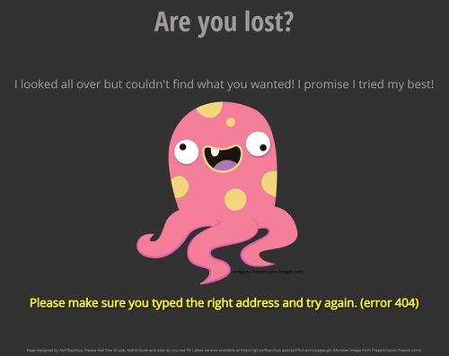
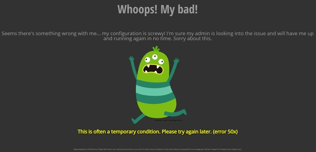

# Fun monster-themed HTML error pages <!-- omit in toc -->

Here are some fun error pages to use instead of the usual boring ones.  I didn't create any of the artwork used on these pages, they are all from [Freepik](http://www.freepik.com).  Individual artists are credited in the pictures and in the page footers.

Feel free to use these pages on your site and/or alter them however you see fit.  Enjoy.

## Contents <!-- omit in toc -->
- [Some screenshots](#some-screenshots)
- [Getting the files](#getting-the-files)
- [Using the error pages (NGINX)](#using-the-error-pages-nginx)
  - [Multiple sites](#multiple-sites)
  - [The pesky 'internal' directive](#the-pesky-internal-directive)
- [Final words](#final-words)

## Some screenshots





## Getting the files

I'll assume you're using a linux server and provide examples of each command on a Debian/Ubuntu system:

1. Switch to your home directory and clone this repo.

    ```bash
    cd ~
    git clone https://git.asifbacchus.app/asif/fun-errorpages.git
    ```

2. Switch to your webroot (I'm assuming NGINX).

    ```bash
    cd /usr/share/nginx/html
    ```

3. Copy the *'errorpages'* directory you cloned in step 1 into your *webroot*.

    ```bash
    cp -R ~/fun-errorpages/errorpages ./
    ```

4. Optionally, remove the temporary directory you created in step 1.  If you do this, you'll have to re-clone this repo for any updates.  If you keep the temporary directory, you can just run *git pull* and then copy the new files into your webroot just like you did above.

## Using the error pages (NGINX)

I almost exclusively use NGINX, so I'll be assuming you do too in the following examples.  For other webservers, the procedure should be similar.  You will be appending the following to your configuration files at the end of the *server* block:

```nginx
# error pages
error_page 400  /errorpages/400.html;
error_page 401  /errorpages/401.html;
error_page 403  /errorpages/403.html;
error_page 404  /errorpages/404.html;
error_page 500 502 503 504  /errorpages/50x.html;

location ^~ /errorpages {
    root    /usr/share/nginx/html;
}
```

### Multiple sites

On many of my webservers, I run mulitple sites/services but would like to use the same fun error pages on each of them.  I could append the above to each server configuration file, or I could just use one file and *include* it in each configuration.  Let's run though that quickly:

1. Make a new file and call it something like *"errorpages.conf"*.  Save the file somewhere that makes sense, like your *NGINX configuration directory* (/etc/nginx/errorpages.conf).
2. In your various server files, at the end of your *server* blocks, simply add the following:

    ```nginx
    include /etc/nginx/errorpages.conf;
    ```

Now NGINX will automatically insert the contents of that *'errorpages.conf* file into your other configuration files where it sees your *include* directive.  This makes it simple to add/remove error pages or change paths -- you only have to edit the one *'errorpages.conf'* file instead of each of your server configuration files individually.

### The pesky 'internal' directive

Following the advice you see almost everywhere, you would expect our error blocks to be set up like this:

```nginx
location ^~ /errorpages {
    root    /usr/share/nginx/html;
    internal;  # notice this directive!
}
```

As noted in the code-block, I'm talking about the **internal;** directive.  This is great since it stops people from directly browsing your error pages.  However, it also stops us from accessing external CSS and images unless we embed them in the HTML which is messy and makes maintenance/updates cumbersome.  Therefore, we omit that *internal;* directive so our pages are allowed to access CSS and linked graphics.  As far as I'm aware, this does not really present any major security or stability issues.  It just means that people can directly browse your now very fun error pages!  **If anyone knows a simple way around this, please let me know!**

## Final words

I hope these error pages liven up your sites and give you a reason to chuckle when you run into errors!  If nothing else, hopefully they inspire you to create some fun error pages of your own :-)  If you have any suggestions, improvements or feedback, leave them in the *'issues'* section of this repo!
